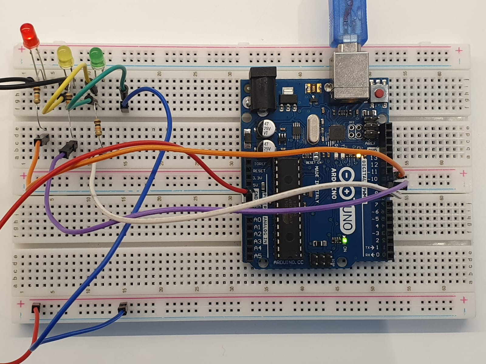

> 
# Relato: Como foi feita a montagem ?
&emsp;&emsp; Para montar a ponderada do Semáforo, realizei a conexão do polo negativo de cada LED com o GND do Arduino e cada polo positivo a um resistor de 10 kΩ, que por sua vez conectei a um pino digital do Arduino (verde, amarelo e vermelho respectivamente aos pinos 8, 9 e 10). Para a temporização, utilizei a função ```delay()``` para controlar o tempo de cada fase do semáforo. Como "ir além", utilizei a orientação a objetos para criar uma classe ```class Semaforo``` que permite instanciar um objeto que contém os métodos para ligar cada cor e para configurar os pinos digitais do Arduíno.

<video controls src="../assets/semaforo-hayashi-video.mp4" title="Vídeo da Ponderada do Semáforo Funcionando"></video>